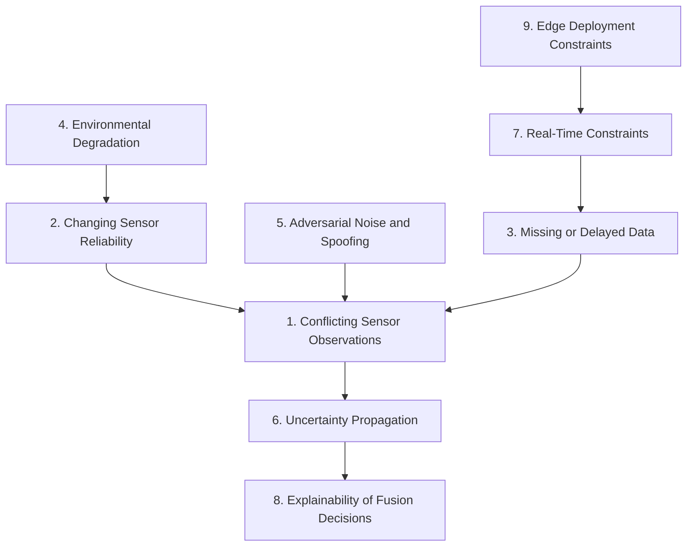

# Phase 2 Gap Analysis: Adaptive Confidence Fusion Engine (ACFE)

This document presents a comprehensive gap analysis for the Adaptive Confidence Fusion Engine (ACFE), designed for defensive AI applications such as disaster response, infrastructure monitoring, and environmental monitoring. It outlines nine critical research gaps, their mathematical problem formulations, and limitations of existing approaches.

## 1. Conflicting Sensor Observations

**Problem Formulation**
Given a set of $N$ sensors, let $z_i \in \mathbb{R}^d$ be the observation from sensor $i$. In conflicting scenarios, the distance metric between observations exceeds a threshold $\tau$: $d(z_i, z_j) > \tau$ for multiple pairs $(i, j)$. The objective is to estimate the true state $x$ given conflicting $Z = \{z_1, \dots, z_N\}$.

**Why Existing Methods Fail**
- **Bayesian Methods:** Rely on well-defined likelihoods $P(Z|x)$. When observations conflict significantly, the joint likelihood peak becomes multi-modal or flat, leading to high-variance estimates.
- **Dempster-Shafer (DS) Theory:** Conflicts lead to high values of the conflict mass $m(\emptyset)$. Normalization in Dempster's rule can produce counter-intuitive results (Zadeh's paradox) when high conflict exists.
- **Kalman Filters:** Assume Gaussian noise. Conflicting data points often manifest as heavy-tailed noise or outliers, causing standard Kalman gains to improperly incorporate bad data.

**Concrete Failure Scenario**
In disaster response (e.g., building collapse), an acoustic sensor detects sound indicating human presence at location A, while thermal imaging shows a heat signature at location B. Existing fusion engines may average these to location C (where no one is), rather than maintaining multiple hypotheses.

**Research Gap**
There is a lack of robust fusion algorithms capable of resolving multi-modal, high-conflict sensor data without arbitrary averaging or heuristic outlier rejection, particularly when the true state distribution is non-Gaussian.

## 2. Changing Sensor Reliability

**Dynamic Reliability Modeling Problem**
Sensor reliability $w_i(t) \in [0, 1]$ is a time-varying function. The estimated state at time $t$ is typically $\hat{x}(t) = \sum_{i=1}^N w_i(t) z_i(t)$. The challenge is estimating $w_i(t)$ accurately in real-time without ground truth.

**Limitations of Static Weighting**
Static weights assume constant noise covariance $R_i$. In real-world environments, $R_i(t)$ fluctuates. Static weighting fails to de-weight a sensor when its signal-to-noise ratio drops unexpectedly.

**Real-World Examples**
- **Sensor Degradation:** A gas sensor's chemical coating degrades over time, slowly shifting its baseline.
- **Weather Effects:** Heavy rain severely reduces LIDAR visibility (increasing noise variance) while having minimal effect on radar.

**Research Gap**
Current systems lack continuous, unsupervised self-assessment mechanisms to dynamically estimate and update $w_i(t)$ based on cross-sensor validation and environmental context.

## 3. Missing or Delayed Data

**Mathematical Formulation**
Let $z_i(t - \delta_i)$ be an observation from sensor $i$ arriving at time $t$, where $\delta_i$ is a variable communication or processing delay. Sometimes, data is missing entirely: $z_i(t) = \emptyset$.

**Imputation vs. Uncertainty Inflation**
Imputing missing data (e.g., using zero-order hold or predictive models) introduces bias. Alternatively, inflating uncertainty bounds avoids bias but can render the fusion output too vague to be actionable.

**Asynchronous Multi-Sensor Fusion Challenges**
Aligning observations with different timestamps requires complex buffering and backward-smoothing (e.g., Out-of-Sequence Measurement processing), which is computationally expensive for high-frequency data.

**Research Gap**
There is a need for efficient, bounded-latency asynchronous fusion architectures that handle out-of-sequence measurements by intelligently trading off between data imputation and uncertainty inflation based on the downstream task's sensitivity.

## 4. Environmental Degradation

**How Environment Affects Calibration**
Sensors are calibrated under controlled conditions. Environmental variables $E(t)$ (temperature, humidity, vibration) induce a drift function $f_{drift}$: $z_i(t) = h(x(t)) + f_{drift}(E(t)) + v_i(t)$.

**Drift Detection and Adaptation**
Detecting $f_{drift}$ is difficult because it can mimic actual changes in the state $x(t)$. Separating environmental drift from true state evolution requires modeling the correlations between $E(t)$ and sensor bias.

**Research Gap**
A significant gap exists in creating adaptable, environment-aware calibration models that can detect and correct $f_{drift}$ online without requiring offline recalibration routines.

## 5. Adversarial Noise and Spoofing

**Threat Models in Defensive Contexts**
Adversaries may inject malicious signals to spoof sensors (e.g., GPS spoofing, projecting adversarial patterns onto cameras). The observation becomes $z_i = h(x) + v_i + a_i$, where $a_i$ is an intelligent adversarial perturbation.

**Robustness Gaps**
Standard fusion methods assume independent, zero-mean noise. Adversarial noise $a_i$ is highly correlated and designed to maximize estimation error.

**Research Gap**
We lack resilient fusion mechanisms that incorporate adversarial threat models and perform real-time anomaly detection to isolate and ignore spoofed sensor streams.

## 6. Uncertainty Propagation across Fusion Layers

**Why Uncertainty Accumulates**
In hierarchical fusion architectures (e.g., sensor level $\rightarrow$ feature level $\rightarrow$ decision level), non-linear transformations at each layer cause approximation errors (e.g., linearization in EKF).

**Calibration Drift in Multi-Stage Pipelines**
If layer $k$ produces an overconfident uncertainty estimate $P_k$, layer $k+1$ will over-weight this input. Over multiple layers, this compounding effect leads to highly inaccurate confidence bounds.

**Research Gap**
There is a critical need for rigorous uncertainty propagation techniques that maintain well-calibrated confidence bounds through deep, non-linear, hierarchical fusion pipelines.

## 7. Real-Time Constraints and Latency

**Latency Budget**
Different domains have strict latency budgets $L_{max}$. For infrastructure collapse monitoring, $L_{max} < 50$ ms may be required to trigger active structural supports.

**Complexity vs. Accuracy Trade-off**
Advanced fusion algorithms (e.g., Particle Filters, deep learning models) offer high accuracy but have computation times $\mathcal{O}(N \times M)$ where $M$ is the number of particles/parameters, often violating $L_{max}$.

**Research Gap**
There is a lack of anytime algorithms or dynamic resource allocation methods for sensor fusion that can guarantee an output within $L_{max}$ while maximizing accuracy given the available compute time.

## 8. Explainability of Fusion Decisions

**Black-Box Fusion in Defensive Applications**
Deep learning-based fusion models operate as black boxes. In defensive and disaster response scenarios, human operators must trust the AI. Without knowing *why* the AI concluded a bridge is failing, operators may hesitate to act.

**Gaps in Existing XAI**
Current eXplainable AI (XAI) methods like SHAP or LIME are designed for static images or tabular data, not for continuous, asynchronous, multi-modal time-series data.

**Research Gap**
We require novel explainability frameworks that can articulate which sensor inputs and historical contexts most heavily influenced a specific fusion output in real-time.

## 9. Edge Deployment Constraints

**Memory, Compute, Power Budgets**
Sensors deployed in disaster zones (e.g., drones, IoT motes) have highly constrained resources. Algorithms must operate on mW power budgets and minimal RAM.

**Gaps in Lightweight Fusion**
Many state-of-the-art fusion models rely on cloud connectivity. When networks fail during a disaster, edge devices cannot process complex fusion models locally.

**Research Gap**
There is a necessity for ultra-lightweight, quantized fusion models that can execute on microcontrollers at the edge while maintaining acceptable accuracy.

---

## Priority Matrix

| Gap | Impact | Feasibility | Priority |
| :--- | :--- | :--- | :--- |
| 1. Conflicting Sensor Observations | High | Medium | High |
| 2. Changing Sensor Reliability | High | High | High |
| 5. Adversarial Noise and Spoofing | High | Low | Medium |
| 8. Explainability of Fusion Decisions | High | Medium | High |
| 3. Missing or Delayed Data | Medium | High | Medium |
| 4. Environmental Degradation | Medium | Medium | Medium |
| 6. Uncertainty Propagation | Medium | Low | Low |
| 7. Real-Time Constraints | Medium | High | Medium |
| 9. Edge Deployment Constraints | High | Medium | High |

---

## Dependency Graph

---

## Conclusion

The ACFE Phase 2 will primarily target gaps that lie at the intersection of high impact and high/medium feasibility. Specifically, the core focus will be on resolving **Conflicting Sensor Observations (1)** and **Changing Sensor Reliability (2)**, as these form the foundational layer of trust in the system. Furthermore, ensuring the **Explainability of Fusion Decisions (8)** is critical for operator adoption in defensive contexts. Addressing **Edge Deployment Constraints (9)** will be the secondary priority to ensure the engine remains viable for field operations where cloud infrastructure is compromised.
