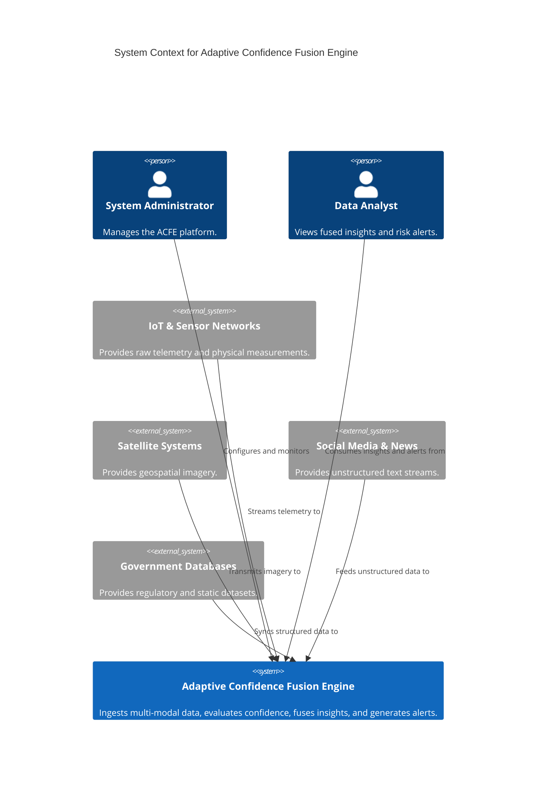
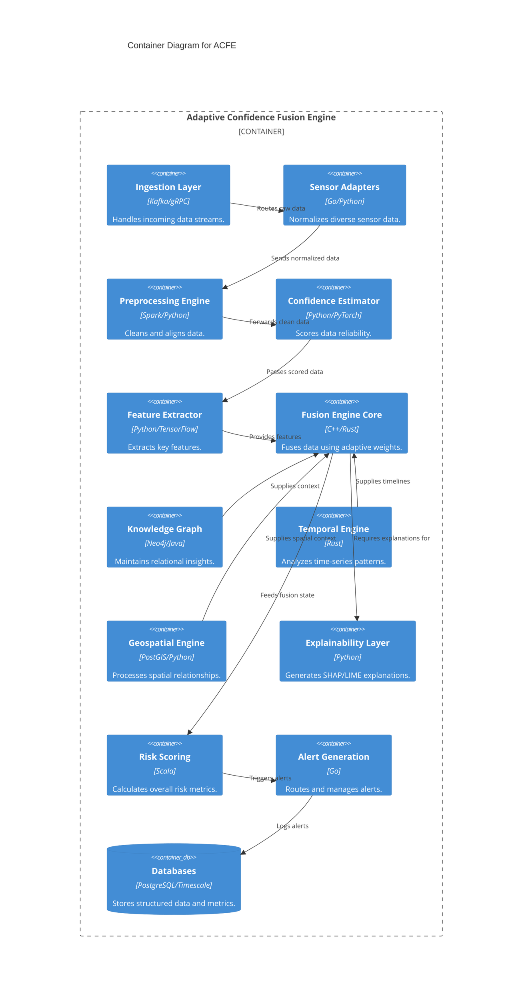
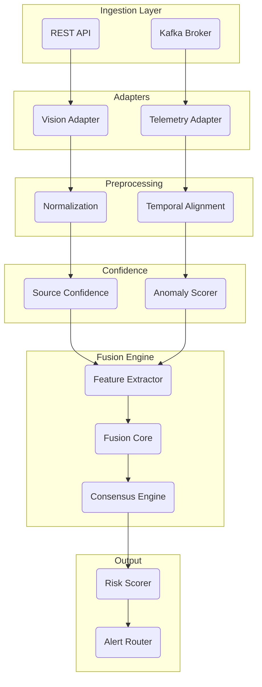
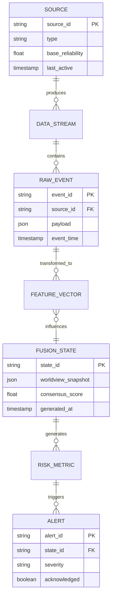
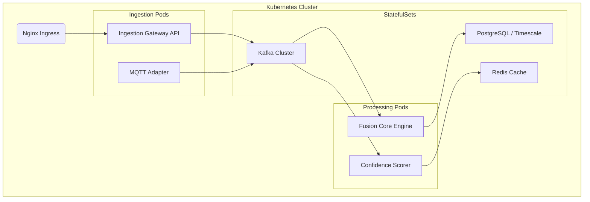

# Phase 4 Adaptive Confidence Fusion Engine (ACFE) - Production Architecture

## 1. Executive Summary
This document outlines the production system architecture for Phase 4 of the Adaptive Confidence Fusion Engine (ACFE). The ACFE is a state-of-the-art, multi-modal data fusion platform designed to ingest, process, and analyze disparate data streams with varying degrees of confidence and reliability. Phase 4 introduces a highly scalable, distributed architecture encompassing 17 distinct layers and over 100 specialized modules. This design ensures high throughput, low latency, robust explainability (XAI), and comprehensive temporal and geospatial reasoning capabilities.

## 2. System Context Diagram (C4 Level 1)



## 3. Container Diagram (C4 Level 2)



## 4. Module Catalog

### Layer 1: Data Ingestion
| ID | Name | Description | Inputs | Outputs | Dependencies |
|---|---|---|---|---|---|
| ACFE-ING-001 | HTTP Ingestion | RESTful data intake | HTTP POST | Raw JSON/XML | None |
| ACFE-ING-002 | MQTT Broker Adapter | Subscribes to MQTT topics | MQTT Streams | Raw JSON/Proto | MQTT Broker |
| ACFE-ING-003 | gRPC Stream Adapter | High-performance RPC | gRPC Streams | Raw Proto | None |
| ACFE-ING-004 | S3/Blob Ingestion | Pulls files from blob storage | S3 Events | Raw Bytes | AWS S3 |
| ACFE-ING-005 | WebSocket Ingestion | Real-time bidirectional feed | WS Frames | Raw JSON | None |
| ACFE-ING-006 | File Batch Ingestion | Processes large bulk files | CSV/Parquet | Raw Batches | Local FS |
| ACFE-ING-007 | Satellite Data Ingestion | Pulls imagery streams | GeoTIFF | Raw Imagery | None |
| ACFE-ING-008 | IoT Gateway Adapter | Interfaces with edge gateways | UDP/CoAP | Raw Telemetry | Edge Nodes |
| ACFE-ING-009 | Database CDC Ingestion | Change Data Capture feeds | Debezium | CDC Events | Kafka |
| ACFE-ING-010 | Message Queue Consumer | AMQP/RabbitMQ integration | AMQP | Message Payloads | RabbitMQ |
| ACFE-ING-011 | Real-time Stream Ingestion | Kinesis/EventHub intake | Kinesis | Stream Records | AWS Kinesis |
| ACFE-ING-012 | Data Validation Gateway | Initial schema check | Raw Data | Validated Data | Schema Registry |

### Layer 2: Sensor Adapters
| ID | Name | Description | Inputs | Outputs | Dependencies |
|---|---|---|---|---|---|
| ACFE-ADP-001 | Camera/Vision Adapter | Processes video streams | H.264/RTSP | Frame Tensors | ACFE-ING-005 |
| ACFE-ADP-002 | LIDAR Adapter | Point cloud normalizer | LAS/PCD | 3D Tensors | ACFE-ING-003 |
| ACFE-ADP-003 | Radar Adapter | Radar signal normalizer | Raw Signal | Radar Tensors | ACFE-ING-003 |
| ACFE-ADP-004 | Weather Sensor Adapter | Meteorological data | JSON | Weather Struct | ACFE-ING-002 |
| ACFE-ADP-005 | Seismic Sensor Adapter | Vibration data | MiniSEED | Seismic Series | ACFE-ING-002 |
| ACFE-ADP-006 | Acoustic Sensor Adapter | Audio streams | WAV/FLAC | Audio Spectrograms | ACFE-ING-003 |
| ACFE-ADP-007 | Satellite Imagery Adapter | Multi-spectral imagery | GeoTIFF | Imagery Tensors | ACFE-ING-007 |
| ACFE-ADP-008 | Social Media Adapter | Twitter/Reddit feeds | JSON | Text/Metadata | ACFE-ING-001 |
| ACFE-ADP-009 | News API Adapter | RSS/News feeds | XML/JSON | Text/Metadata | ACFE-ING-001 |
| ACFE-ADP-010 | Government Data Adapter | Census/Regulatory | CSV/JSON | Structured Data | ACFE-ING-006 |
| ACFE-ADP-011 | IoT Telemetry Adapter | Generic IoT data | JSON | Telemetry Struct | ACFE-ING-008 |
| ACFE-ADP-012 | SCADA Adapter | Industrial control data | Modbus/OPC | SCADA Struct | ACFE-ING-003 |
| ACFE-ADP-013 | Network Traffic Adapter | PCAP data | PCAP | NetFlow Struct | ACFE-ING-011 |
| ACFE-ADP-014 | Log Stream Adapter | Syslog/Application logs | Text | Log Struct | ACFE-ING-010 |
| ACFE-ADP-015 | Manual Report Adapter | Human-entered intelligence | JSON | Report Struct | ACFE-ING-001 |

### Layer 3: Preprocessing
| ID | Name | Description | Inputs | Outputs | Dependencies |
|---|---|---|---|---|---|
| ACFE-PRE-001 | Data Normalization | Z-score/Min-max scaling | Raw Structs | Scaled Structs | Layer 2 |
| ACFE-PRE-002 | Missing Value Handler | Imputation algorithms | Incomplete Data | Complete Data | Layer 2 |
| ACFE-PRE-003 | Outlier Detection | Statistical anomaly removal | Raw Data | Clean Data | Layer 2 |
| ACFE-PRE-004 | Temporal Alignment | Syncs timestamps | Unsynced Data | Synced Data | Layer 2 |
| ACFE-PRE-005 | Coordinate Transformation | EPSG standardizer | Raw Coordinates | WGS84 Coords | Layer 2 |
| ACFE-PRE-006 | Format Standardization | Enforces canonical schemas | Diverse Structs | Canonical Structs | Layer 2 |
| ACFE-PRE-007 | Quality Scoring | Assesses intrinsic data quality | Canonical Data | Data + Q-Score | Layer 2 |
| ACFE-PRE-008 | Deduplication Engine | Removes duplicates | Data Stream | Unique Data | Layer 2 |

### Layer 4: Confidence Estimation
| ID | Name | Description | Inputs | Outputs | Dependencies |
|---|---|---|---|---|---|
| ACFE-CONF-001 | Per-source Confidence Scorer | Baseline source trust | Clean Data | Base Confidence | ACFE-PRE-007 |
| ACFE-CONF-002 | Uncertainty Quantifier | Bayesian uncertainty | Clean Data | Variance Metric | ACFE-PRE-007 |
| ACFE-CONF-003 | Calibration Engine | Adjusts raw probabilities | Probabilities | Calibrated Probs | None |
| ACFE-CONF-004 | Reliability Tracker | Long-term source accuracy | Historical Data | Reliability Score | ACFE-DB-002 |
| ACFE-CONF-005 | Sensor Health Monitor | Hardware diagnostic integration | Diagnostics | Health Penalty | ACFE-ADP-011 |
| ACFE-CONF-006 | Anomaly Confidence Adjuster | Lowers confidence on sudden spikes | Clean Data | Adjusted Score | ACFE-PRE-003 |
| ACFE-CONF-007 | Temporal Decay Engine | Reduces confidence over time | Stale Data | Decayed Score | None |
| ACFE-CONF-008 | Cross-validation Scorer | Checks against independent peers | Multi-source Data | Cross-val Score | None |
| ACFE-CONF-009 | Ensemble Confidence Aggregator | Combines confidence metrics | All Scores | Final Conf Score | ACFE-CONF-001-008 |
| ACFE-CONF-010 | Confidence Audit Logger | Logs rationale for scores | Conf Scores | Audit Log | ACFE-DB-001 |

### Layer 5: Feature Extraction
| ID | Name | Description | Inputs | Outputs | Dependencies |
|---|---|---|---|---|---|
| ACFE-FEAT-001 | Vision Feature Extractor | ResNet/ViT embeddings | Image Tensors | Vision Vectors | ACFE-CONF-009 |
| ACFE-FEAT-002 | Time-series Feature Extractor | Wavelets/Fourier features | Time-series | TS Vectors | ACFE-CONF-009 |
| ACFE-FEAT-003 | Text/NLP Feature Extractor | BERT embeddings | Text | NLP Vectors | ACFE-CONF-009 |
| ACFE-FEAT-004 | Geospatial Feature Extractor | Spatial topologies | Geometries | Geo Vectors | ACFE-CONF-009 |
| ACFE-FEAT-005 | Graph Feature Extractor | Node2Vec/GNN | Graph Data | Graph Vectors | ACFE-KG-001 |
| ACFE-FEAT-006 | Multi-modal Feature Aligner | Projects to common latent space | All Vectors | Aligned Latents | ACFE-FEAT-001-005 |
| ACFE-FEAT-007 | Feature Importance Ranker | Pre-computes feature utility | Aligned Latents | Ranked Features | None |
| ACFE-FEAT-008 | Feature Cache Manager | Caches embeddings in Redis | Vectors | Cache IDs | ACFE-DB-003 |

### Layer 6: Fusion Engine (THE CORE)
| ID | Name | Description | Inputs | Outputs | Dependencies |
|---|---|---|---|---|---|
| ACFE-FUS-001 | ACFE-Core Fusion Engine | Main evidential reasoning core | Features + Conf | Fused State | All Features |
| ACFE-FUS-002 | ACFE-Temporal Tracker | Kalman/Particle filters | Time Features | Temporal State | ACFE-TMP-001 |
| ACFE-FUS-003 | ACFE-Graph Engine | Relational fusion | Graph Vectors | Graph State | ACFE-KG-005 |
| ACFE-FUS-004 | ACFE-XAI Attribution Engine | Maps fusion back to inputs | Fused State | Attributions | ACFE-XAI-001 |
| ACFE-FUS-005 | Conflict Resolver | Dempster-Shafer conflict handling | Conflicting Data | Resolved Data | ACFE-CONF-009 |
| ACFE-FUS-006 | Consensus Engine | Bayesian voting models | Multi-source State| Consensus State | ACFE-CONF-009 |
| ACFE-FUS-007 | Fusion Orchestrator | Directs DAG of fusion | All States | Execution Plan | None |
| ACFE-FUS-008 | Fusion State Manager | Maintains in-memory worldview | Fused State | Current Worldview | ACFE-DB-003 |
| ACFE-FUS-009 | Output Calibrator | Final probability smoothing | Worldview | Calibrated Output | None |
| ACFE-FUS-010 | Fusion Audit Trail | Cryptographic ledger of fusion | Operations | Hash Trail | ACFE-DB-001 |
| ACFE-FUS-011 | Adaptive Weight Optimizer | ML-driven weight adjustment | Feedback | New Weights | None |
| ACFE-FUS-012 | Fallback Fusion Engine | Simple heuristic fusion for safety | Raw Features | Safe State | None |

### Layer 7: Knowledge Graph
| ID | Name | Description | Inputs | Outputs | Dependencies |
|---|---|---|---|---|---|
| ACFE-KG-001 | Entity Extractor | NER from text/logs | NLP Vectors | Entities | ACFE-FEAT-003 |
| ACFE-KG-002 | Relation Mapper | Maps entity relationships | Entities | Triplets | None |
| ACFE-KG-003 | Graph Store Interface | Abstraction for Neo4j | Triplets | Graph DB Write | ACFE-DB-004 |
| ACFE-KG-004 | Ontology Manager | Maintains domain schema | Schema Defs | Active Ontology | None |
| ACFE-KG-005 | Graph Query Engine | Cypher query execution | Query | Graph Subgraph | ACFE-DB-004 |
| ACFE-KG-006 | Knowledge Updater | Continuous graph refinement | Fused State | Updated Nodes | ACFE-FUS-001 |

### Layer 8: Temporal Reasoning
| ID | Name | Description | Inputs | Outputs | Dependencies |
|---|---|---|---|---|---|
| ACFE-TMP-001 | Event Timeline Manager | Orders discrete events | Fused Events | Timeline | ACFE-DB-002 |
| ACFE-TMP-002 | Causal Chain Analyzer | Determines Granger causality | Timeline | Causal Links | None |
| ACFE-TMP-003 | Temporal Pattern Detector | Motif discovery | Time-series | Motifs | ACFE-FEAT-002 |
| ACFE-TMP-004 | Prediction Horizon Engine | Forecasts future states | Current State | Future State | ACFE-FUS-001 |
| ACFE-TMP-005 | Time Window Manager | Sliding/Tumbling windows | Stream | Windows | ACFE-STR-004 |
| ACFE-TMP-006 | Temporal Anomaly Detector | Sequence anomaly spotting | Windows | Anomaly Flags | None |

### Layer 9: Geospatial Engine
| ID | Name | Description | Inputs | Outputs | Dependencies |
|---|---|---|---|---|---|
| ACFE-GEO-001 | Coordinate Reference System Mgr | EPSG transformations | Coords | Standard Coords | None |
| ACFE-GEO-002 | Spatial Indexer | R-Tree/QuadTree indexing | Geometries | Spatial Index | ACFE-DB-001 |
| ACFE-GEO-003 | Geofence Engine | Polygon intersection checks | Coords, Polygons| Fence Events | None |
| ACFE-GEO-004 | Proximity Analyzer | Distance/KNN queries | Coords | Proximity Lists | None |
| ACFE-GEO-005 | Heatmap Generator | Density estimations | Coords | Heatmap Matrix | None |
| ACFE-GEO-006 | Terrain Analyzer | Elevation/LOS calculations | DEM Data | LOS Metrics | ACFE-ING-007 |
| ACFE-GEO-007 | Satellite Imagery Processor | NDVI/Change detection | Imagery Tensors | Change Maps | ACFE-ADP-007 |

### Layer 10: Explainability
| ID | Name | Description | Inputs | Outputs | Dependencies |
|---|---|---|---|---|---|
| ACFE-XAI-001 | SHAP Engine | Shapley value computation | Model, Input | SHAP Values | ACFE-FUS-001 |
| ACFE-XAI-002 | LIME Engine | Local surrogate models | Model, Input | LIME Explanations | ACFE-FUS-001 |
| ACFE-XAI-003 | Counterfactual Generator | "What-if" scenario runner | Fused State | Counterfactuals | ACFE-FUS-001 |
| ACFE-XAI-004 | Feature Importance Visualizer | Formats rankings for UI | SHAP/LIME | Visual JSON | None |
| ACFE-XAI-005 | Decision Tree Surrogate | Global explainability tree | Fused State | Tree Rules | None |
| ACFE-XAI-006 | Natural Language Explainer | LLM-based text summaries | Explanations | Text Summary | None |
| ACFE-XAI-007 | Audit Explanation Logger | Persists XAI metadata | Explanations | Audit Records | ACFE-DB-001 |
| ACFE-XAI-008 | Explanation API | Serves XAI to frontend | Request | XAI JSON | ACFE-API-001 |

### Layer 11: Risk Scoring
| ID | Name | Description | Inputs | Outputs | Dependencies |
|---|---|---|---|---|---|
| ACFE-RSK-001 | Multi-dimensional Risk Scorer | Computes vector risks | Fused State | Risk Vectors | ACFE-FUS-001 |
| ACFE-RSK-002 | Risk Threshold Manager | Dynamic thresholding | Risk Vectors | Breach Events | None |
| ACFE-RSK-003 | Historical Risk Analyzer | Compares against baseline | Risk Vectors | Trend Metrics | ACFE-DB-002 |
| ACFE-RSK-004 | Risk Propagation Engine | Network risk diffusion | Risk + Graph | Cascading Risks | ACFE-KG-005 |
| ACFE-RSK-005 | Risk Dashboard API | Aggregates for UI | Risk Metrics | Dashboard JSON | ACFE-API-001 |

### Layer 12: Alert Generation
| ID | Name | Description | Inputs | Outputs | Dependencies |
|---|---|---|---|---|---|
| ACFE-ALT-001 | Alert Rule Engine | Evaluates conditions (Drools) | Risk/Events | Raw Alerts | ACFE-RSK-001 |
| ACFE-ALT-002 | Alert Deduplicator | Groups identical alerts | Raw Alerts | Unique Alerts | ACFE-DB-003 |
| ACFE-ALT-003 | Alert Prioritizer | Ranks by severity/confidence | Unique Alerts | Ranked Alerts | ACFE-CONF-009 |
| ACFE-ALT-004 | Alert Router | Dispatches to channels (SMS/Email)| Ranked Alerts | Dispatch Events | None |
| ACFE-ALT-005 | Alert Escalation Manager | PagerDuty-style escalation | Unack'd Alerts | Escalation Events | None |
| ACFE-ALT-006 | Alert Audit Log | Compliance tracking | Dispatch Events | Audit Records | ACFE-DB-001 |

### Layer 13: Streaming Architecture
| ID | Name | Description | Inputs | Outputs | Dependencies |
|---|---|---|---|---|---|
| ACFE-STR-001 | Kafka Producer | Standardized event publishing | Internal Data | Kafka Topic | Kafka |
| ACFE-STR-002 | Kafka Consumer | Standardized event polling | Kafka Topic | Internal Data | Kafka |
| ACFE-STR-003 | Redis Pub/Sub | Low-latency volatile messaging | Events | Pub/Sub Channels | Redis |
| ACFE-STR-004 | Stream Processor | Flink/Spark streaming core | Streams | Processed Streams | Flink |
| ACFE-STR-005 | Backpressure Manager | Dynamically throttles ingestion | Load Metrics | Throttle Signals | None |
| ACFE-STR-006 | Dead Letter Queue | Handles failed messages | Failed Msgs | DLQ Store | Kafka |
| ACFE-STR-007 | Stream Monitor | Tracks lag and throughput | Kafka JMX | Stream Metrics | ACFE-MON-001 |
| ACFE-STR-008 | Replay Engine | Time-travel debugging | Historical Logs | Replayed Stream | Kafka |

### Layer 14: API Layer
| ID | Name | Description | Inputs | Outputs | Dependencies |
|---|---|---|---|---|---|
| ACFE-API-001 | REST API Gateway | External entrypoint (Kong/Envoy)| HTTP Request | Internal Routing | ACFE-SEC-001 |
| ACFE-API-002 | WebSocket Server | Real-time pushes to UI | WS Conn | Real-time Data | ACFE-STR-003 |
| ACFE-API-003 | GraphQL Endpoint | Flexible data querying | GQL Query | JSON Response | All DBs |
| ACFE-API-004 | API Rate Limiter | Prevents abuse | Requests | Allow/Deny | Redis |
| ACFE-API-005 | Request Validator | OpenAPI schema validation | HTTP Request | Validated Req | None |
| ACFE-API-006 | Response Formatter | Standardizes output envelopes | Raw Output | JSON Envelope | None |
| ACFE-API-007 | API Versioning Manager | Handles v1/v2 routing | HTTP Request | Routed Req | None |
| ACFE-API-008 | Health Check Endpoint | Liveness/Readiness probes | Ping | Status JSON | None |
| ACFE-API-009 | Metrics Endpoint | Exposes Prometheus /metrics | Scrape | Prom Format | ACFE-MON-001 |
| ACFE-API-010 | Documentation Server | Swagger UI | HTTP | HTML Docs | None |

### Layer 15: Auth and Security
| ID | Name | Description | Inputs | Outputs | Dependencies |
|---|---|---|---|---|---|
| ACFE-SEC-001 | JWT Auth Manager | Token validation | Token | Claims | None |
| ACFE-SEC-002 | OAuth2 Provider | External IDP integration | Credentials | Access Token | Keycloak |
| ACFE-SEC-003 | RBAC Engine | Role-based access control | Claims, Resource| Allow/Deny | ACFE-DB-001 |
| ACFE-SEC-004 | API Key Manager | Service-to-service auth | API Key | Client ID | ACFE-DB-001 |
| ACFE-SEC-005 | Security Audit Logger | Logs auth failures/access | Auth Events | Audit Log | ACFE-DB-001 |

### Layer 16: Database
| ID | Name | Description | Inputs | Outputs | Dependencies |
|---|---|---|---|---|---|
| ACFE-DB-001 | PostgreSQL Repository | Relational config/state | SQL | Resultset | PostgreSQL |
| ACFE-DB-002 | TimescaleDB | High-volume metrics/events | SQL | Resultset | TimescaleDB |
| ACFE-DB-003 | Redis Cache Manager | KV caching | KV Commands | Values | Redis |
| ACFE-DB-004 | Graph Database Interface | Neo4j interaction | Cypher | Graph Nodes | Neo4j |
| ACFE-DB-005 | Schema Migration Manager | Flyway/Liquibase | Migrations | DB State | All DBs |
| ACFE-DB-006 | Backup & Recovery Mgr | Automated snapshots | Cron/Trigger | Backup Archives | S3 |

### Layer 17: Monitoring and Observability
| ID | Name | Description | Inputs | Outputs | Dependencies |
|---|---|---|---|---|---|
| ACFE-MON-001 | Prometheus Collector | Metric scraping | App /metrics | Time-series | Prometheus |
| ACFE-MON-002 | Grafana Dashboard Mgr | Visualizations | PromQL | UI Dashboards | Grafana |
| ACFE-MON-003 | Distributed Tracing | OpenTelemetry/Jaeger | Spans | Trace Graphs | Jaeger |
| ACFE-MON-004 | Log Aggregator (ELK) | Centralized logging | Logs | Searchable Logs | Elasticsearch |
| ACFE-MON-005 | Health Dashboard | High-level system status | Metrics | Status UI | None |
| ACFE-MON-006 | SLO Monitor | Tracks error budgets | Metrics | SLO Alerts | Prometheus |

## 5. Data Flow Diagram (Mermaid)



## 6. Sequence Diagram: Full Fusion Request Lifecycle

```mermaid
sequenceDiagram
    participant S as Sensor
    participant IG as ACFE-ING-001 (Gateway)
    participant AD as ACFE-ADP (Adapter)
    participant PR as ACFE-PRE (Preprocess)
    participant CF as ACFE-CONF (Confidence)
    participant FE as ACFE-FEAT (Feature)
    participant FUS as ACFE-FUS (Fusion Core)
    participant RSK as ACFE-RSK (Risk)
    participant ALT as ACFE-ALT (Alerts)
    
    S->>IG: Raw Payload (JSON)
    IG->>AD: Route to specific adapter
    AD->>PR: Normalized Canonical Struct
    PR->>CF: Clean Data
    CF->>CF: Calculate Reliability & Uncertainty
    CF->>FE: Data + Confidence Score
    FE->>FUS: Latent Feature Vectors
    FUS->>FUS: Dempster-Shafer Conflict Resolution
    FUS->>FUS: Adaptive Weight Updates
    FUS->>RSK: Unified Worldview State
    RSK->>ALT: Risk Vector > Threshold
    ALT->>ALT: Deduplicate & Prioritize
    ALT->>S: (Optional) Control Feedback / Alert Dispatch
```

## 7. Entity Relationship (ER) Diagram



## 8. Deployment Topology (Kubernetes)



## 9. Technology Stack

| Domain | Technologies |
|---|---|
| Languages | Go (Microservices), Python (ML/XAI), C++/Rust (Core Fusion), Scala (Spark) |
| Streaming/Messaging | Apache Kafka, RabbitMQ, Redis Pub/Sub, gRPC |
| Data Processing | Apache Flink, Apache Spark |
| ML / AI | PyTorch, TensorFlow, Scikit-learn, SHAP |
| Databases | PostgreSQL, TimescaleDB, Neo4j, Redis, Elasticsearch |
| Infrastructure | Kubernetes (EKS/GKE), Docker, Helm |
| Observability | Prometheus, Grafana, Jaeger, ELK Stack |
| Security | Keycloak, OAuth2, JWT, HashiCorp Vault |

## 10. Interface Contracts (API Schemas)

**Ingestion Payload Schema (OpenAPI 3.0)**
```json
{
  "type": "object",
  "required": ["source_id", "timestamp", "modality", "payload"],
  "properties": {
    "source_id": { "type": "string", "example": "cam-northeast-01" },
    "timestamp": { "type": "string", "format": "date-time" },
    "modality": { "type": "string", "enum": ["vision", "telemetry", "text"] },
    "payload": {
      "type": "object",
      "description": "Modality-specific data wrapper"
    }
  }
}
```

**Fusion Output Schema (Alert Generation)**
```json
{
  "type": "object",
  "properties": {
    "state_id": { "type": "string" },
    "worldview_summary": { "type": "string" },
    "overall_confidence": { "type": "number", "minimum": 0, "maximum": 1 },
    "risk_factors": {
      "type": "array",
      "items": {
        "type": "object",
        "properties": {
          "dimension": { "type": "string" },
          "score": { "type": "number" },
          "xai_attribution": { "type": "object" }
        }
      }
    }
  }
}
```

## 11. Non-Functional Requirements (NFRs)

*   **Latency**: The end-to-end processing time (from Ingestion to Alert Generation) must not exceed 250ms for the 95th percentile (p95) on the fast-path (excluding heavy vision models which have a 1500ms p95 SLA).
*   **Throughput**: The system must sustain an ingestion rate of 100,000 events per second per cluster instance.
*   **Availability**: 99.99% uptime (Four Nines), equating to less than 52.6 minutes of downtime per year, achieved through multi-AZ Kubernetes deployments and active-active Kafka clustering.
*   **Scalability**: Stateless processing layers (Adapters, Confidence, Feature, Fusion) must scale horizontally via Kubernetes HPA (Horizontal Pod Autoscaler) based on CPU utilization and Kafka consumer lag.
*   **Security**: All data in transit must be encrypted via TLS 1.3. Data at rest must be encrypted using AES-256.

---
*Generated for the ACFE Architecture Review Board.*
